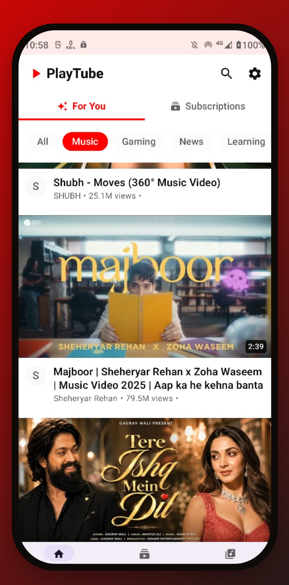
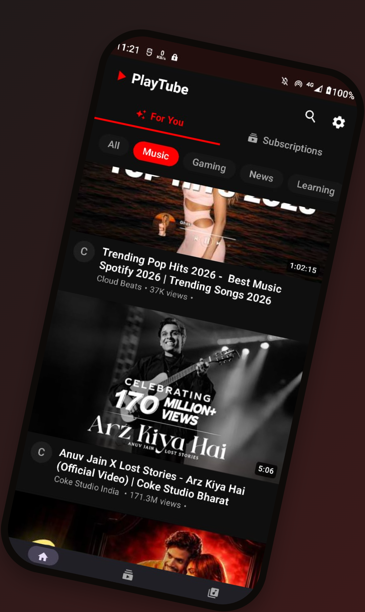
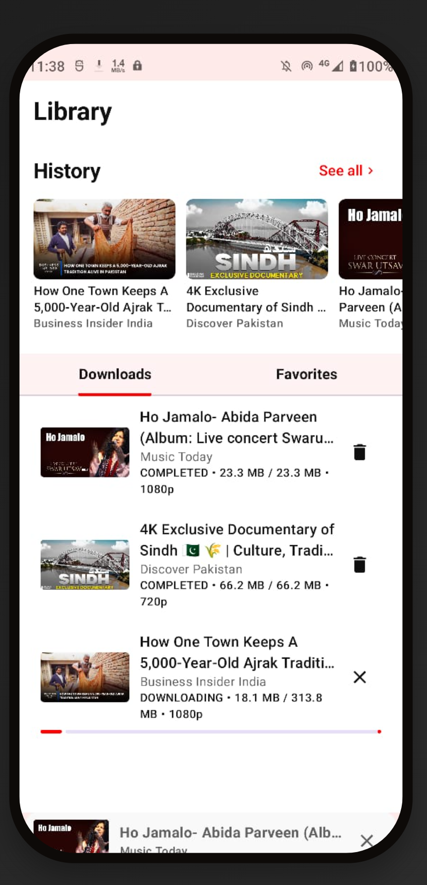
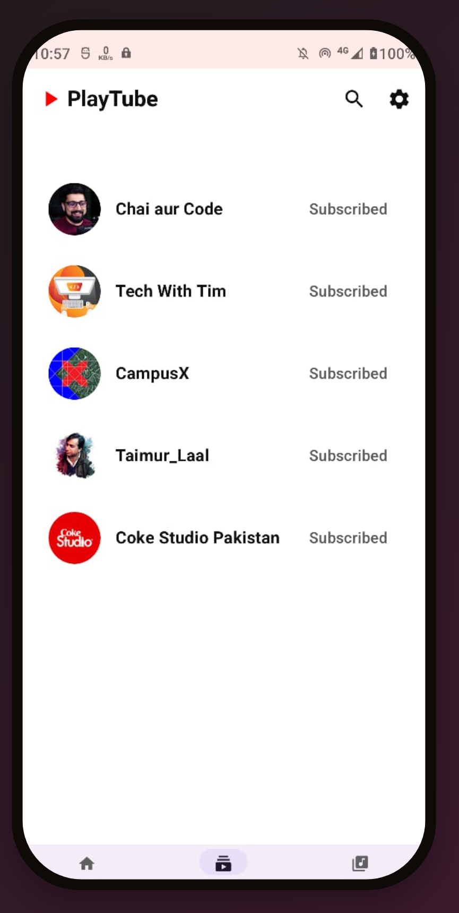

PlayTube is a fast, private, and feature-rich YouTube client for Android.

## Key Features:
- Background Play
- Picture-in-Picture Support
- Highest available video quality downloads
- Built-in video volume/brightness gestures
- Push up & down landscape/portrait modes
- Subscription Management
- Search History & Privacy
- Dynamic UI, Smooth, full-screen browsing experience.
## ScreenShots:

Enjoy a premium video experience  with no ads or tracking. 
